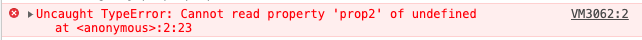
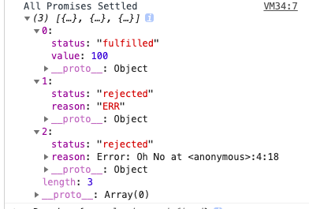
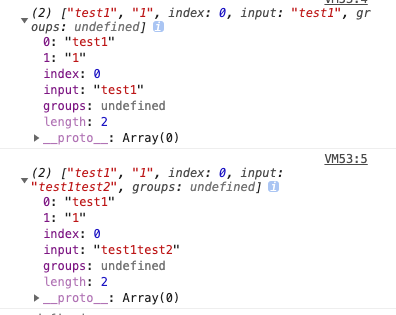
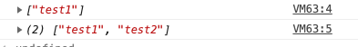

在2020年4月2日TC39 委员会批准了[ ECMAScript 2020（即 ES2020）](https://github.com/tc39/ecma262/releases/tag/es2020)候选提案，即经审定最终添加到 JavaScript 语言中的特性集

## ES标准的制定者-TC39

TC39是ECMA的第39号技术专家委员会（Technical Committee 39）的简称，是ECMAScript标准的实际制定者这个委员会并不是一个人，而是负责制定ECMAScript标准的一群人，其成员主要由各个JS引擎（浏览器）厂商工作人员组成

每个 ECMAScript 特性提案将经历如下五个[成熟度阶段](https://tc39.github.io/process-document/)，即Stage 0：“稻草人”（Strawman）阶段； Stage 1：提议阶段；Stage 2：草案阶段；Stage 3：候选阶段；Stage 4：完成阶段。达成阶段 4 的特性，将添加到标准中，并可安全使用

## 一般可以去哪里查看TC39标准的进程呢？

[tc39/proposals](https://github.com/tc39/proposals/blob/master/finished-proposals.md) 可以看到已经处于 finish 状态的草案。或者你可以在[这个网站](https://prop-tc39.now.sh/)查看所有草案。

## ES2020的新特性

### 可选链操作符（Optional Chaining）

可选链 可以让我们在查询具有多个层级的对象时，不再需要进行冗余的各种前置校验

比如，

```javascript
let obj = {}
console.log(obj.prop1.prop2)
```




为了防止报以下错误代码我们就要像下面这样写

```javascript
let obj = {}
console.log(obj&&obj.prop1&&obj.prop1.prop2)
```

有了可选链式调用 ，可以大量简化类似繁琐的前置校验操作，而且更安全：

```javascript
let obj = {}
console.log(obj?.prop1?.prop2)
```


### 空位合并操作符（Nullish coalescing Operator）

在开发过程中，变量如果是空值，就使用默认值，

```javascript
let c = a?a:b
let c = a || b
```

这两种方式有两个弊端，它都会覆盖所有的假值，如：0，''，false，这些值可能是在某些情况下为有效的输入

为了解决这个问题，提议了一个合并运算符，用??表示。有了它，我们仅在第一项为null或undefined时设置默认值。

```javascript
let c = a??b//等价于let c = a !== undefined && a !== null ? a : b;
```

以下图也可以看出区别


### BigInt

javascript 在 Math 上一直很糟糕的原因之一是只能安全的表示`-(2^53-1)`至 `2^53-1` 范的值，即`Number.MIN_SAFE_INTEGER` 至`Number.MAX_SAFE_INTEGER`，超出这个范围的整数计算或者表示会丢失精度。

```javascript
var num = Number.MAX_SAFE_INTEGER;  // -> 9007199254740991

num = num + 1; // -> 9007199254740992

// 再次加 +1 后无法正常运算
num = num + 1; // -> 9007199254740992

// 两个不同的值，却返回了true
9007199254740992 === 9007199254740993  // -> true

```

于是 BigInt 应运而生，**它是第7个原始类型，可安全地进行大数整型计算**。

创建 BigInt 类型的值也非常简单，只需要在数字后面加上 n 即可。例如，123 变为 123n。也可以使用全局方法 BigInt(value) 转化，入参 value 为数字或数字字符串。

```javascript
const aNumber = 111;
const aBigInt = BigInt(aNumber);
aBigInt === 111n // true
typeof aBigInt === 'bigint' // true
typeof 111 // "number"
typeof 111n // "bigint"
```


### Promise.allSettled

Promise.all具有并发执行异步任务的能力，但它最大问题就是如果参数中的任何一个promise为reject的话，则整个Promise.all调用就会立即终止，并返回一个reject的新的Promise对象。

```javascript
const myPromiseArray = [
  Promise.resolve(100),
  Promise.reject('ERR'),
  Promise.reject(new Error('Oh No'))
]
Promise.all(myPromiseArray).then(responses=>{
  console.log('Promise All', responses)
}).catch(err=>{
  console.log('promise All catch', err)
})
// 打印结果：promise All catch err
```

则这个的打印结果是：promise All catch err，这里就没有对成功的进行处理


但是如果用Promise.allSettled,

```javascript
const myPromiseArray = [
  Promise.resolve(100),
  Promise.reject('ERR'),
  Promise.reject(new Error('Oh No'))
]
Promise.allSettled(myPromiseArray).then(results=>{
  console.log('All Promises Settled', results)
})
```

打印结果是：三个对象，包含了最终的状态，status为'fulfilled'为成功，status为'rejected'为失败



Promise.allSettled跟Promise.all类似, 其参数接受一个Promise的数组, 返回一个新的Promise, **唯一的不同在于, 它不会进行短路**, 也就是说当Promise全部处理完成后,我们可以拿到每个Promise的状态, 而不管是否处理成功。

### Dynamic import

通过动态导入代码，您可以减少应用程序加载所需的时间，并尽可能快地将某些内容返回给用户。

```javascript
if(myCondition) {
  import('./dynamicmodule.js').then(model=>{
      module.addNumbers(3,4)
  }).catch(err=>{
    console.log('err', err)
  })
}
```

###  String.prototype.matchAll

当我们正则用字符串的match去匹配的时候,可以获得第一个完整匹配和相关的捕获组（Array）

```javascript
const reg = /test(\d)/;
const str1 = `test1`;
const str2 = `test1test2`;
console.log(str1.match(reg)); // ["test1", "1"]
console.log(str2.match(reg)); // ["test1", "1"]
```



这里我们的str2并没有获取到test2的匹配，我们要获取完整的匹配，就要加上全局匹配符/g

```javascript
const reg = /test(\d)/g;
const str1 = `test1`;
const str2 = `test1test2`;
console.log(str1.match(reg)); // ["test1"]
console.log(str2.match(reg)); // ["test1", "test2"]
```



但这里加上全局的匹配符后就不会返回捕获组。

matchAll就是为了解决这个问题

matchAll()方法返回一个包含所有匹配正则表达式的结果及分组捕获组的迭代器

```javascript
const reg = /test(\d)/g;
const str1 = `test1`;
const str2 = `test1test2`;
const matches1 = str1.matchAll(reg); // RegExpStringIterator {}
const matches2 = str2.matchAll(reg); // RegExpStringIterator {}
[...matches1]; // [["test1", "1"]]
[...matches2]; // [["test1", "1"], [["test2", "2"]]]
```


### globalThis

提供访问全局 this 值的通用操作方式 globalThis

##  参考资料

1.[ES2020新特性](https://juejin.im/post/5e1bcaa1f265da3e140fa3ee)

2.[了解ES新特性](https://juejin.im/post/5e45fd4ef265da57127e3bc5)

