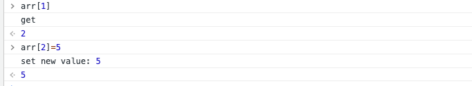
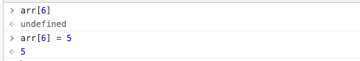

vue3.0中，响应式数据部分弃用了 `Object.defineProperty`，使用 `Proxy` 来代替它。为什么弃用它，看了一些技术博客，原因有如下几点：

1. `Object.defineProperty`无法监控数组下标的变化
2. `Object.defineProperty`无法监控对象新增属性值

## 无法监控数组下标的变化？

在一些技术博客上看到过这样一些说法，认为`Object.defineProperty`有一个缺陷是无法监听数组变化，我一直感觉到很疑惑，所以今天自己写代码尝试了一下：

首先自己定义了一个observe函数来监控data，里面的实现原理就是用的Object.defineProperty

```javascript
function defineReactive (data, key, value){
  Object.defineProperty(data,key,{
    enumerable: true,
    configurable: true,
    get: function(){
      console.log('get')
      return value
    },
    set: function(newVal) {
      console.log('set new value:', newVal)
      value = newVal
    }
  })
}
function observe(data){
  Object.keys(data).forEach((key)=>{
    defineReactive(data,key,data[key])
  })
}
```

通过下标设值

```javascript
let arr = [1,2,3]
observe(arr)
arr[1]
arr[1] = 'change'
```

可以看到，通过下标获取某个元素会触发getter方法，设置某个值会触发setter方法



但是，如果下标超过当前数组长度值时，不会触发getter方法和setter方法


所以我认为`Object.defineProperty` 本身是可以监控到数组下标的变化的（下标在数组长度范围内），只是在 Vue 的实现中，从性能/体验的性价比考虑，放弃了这个特性。在下标超出数组长度范围内的时候，无法检测到变化，其实这个就和对象的表现是一致了，数组的索引可以看做是对象的key，下面就讲分析对象的表现。

## `Object.defineProperty`无法监控对象新增属性值

首先看一下监控已有的属性值
```javascript
let obj = {a:1}
observe(obj)
obj.a
obj.a = 'change'
```


获取和修改已有属性值会触发getter和setter方法


获取一个新增属性值并且对新增属性值进行赋值
```javascript
let obj = {a:1}
observe(obj)
obj.b
obj.b = 'change'
```
并没有触发getter和setter方法


所以`Object.defineProperty`无法监控对象新增属性值，这也可以解释在数组长度外的下标进行赋值也不会无法触发setter和getter方法
由此可见，`Object.defineProperty`是监听对象属性的。

## 为什么用proxy代替Object.defineProperty
proxy可以直接监听对象而非属性

用proxy改写observe方法

```javascript
function observe(data){
return new Proxy(data, {
    get: function (target, propKey, receiver) {
      console.log(`getting ${propKey}!`);
      return Reflect.get(target, propKey, receiver);
    },
    set: function (target, propKey, value, receiver) {
      console.log(`setting ${propKey}!`);
      return Reflect.set(target, propKey, value, receiver);
    }
  });
}
```

数组监控

```javascript
let arr = [1,2,3]
let p = observe(arr)
p[0] //getting 0!
p[0] = 'change' //setting 0!
p[5] //getting 5!
p[5] = 'change'//setting 6!
```

数组下标在长度内和长度外都能触发监控

对象监控

```javascript
let obj = {a:1}
let p = observe(arr)
p.a
p.a = 'change'
p.b
p.b = 'change'
```

已有属性和新增属性都能触发监控

## 总结

1. Object.defineProperty是对属性监控而proxy是对对象监控
2. 用了proxy就不用循环对象的属性，性能提高


## 参考

https://juejin.im/post/5da29a87518825094e37301c

https://github.com/Rashomon511/LearningRecord/issues/455