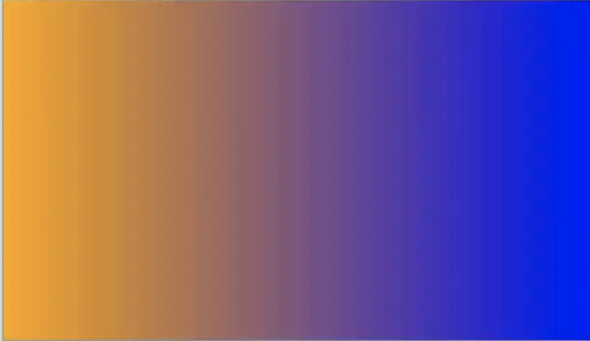
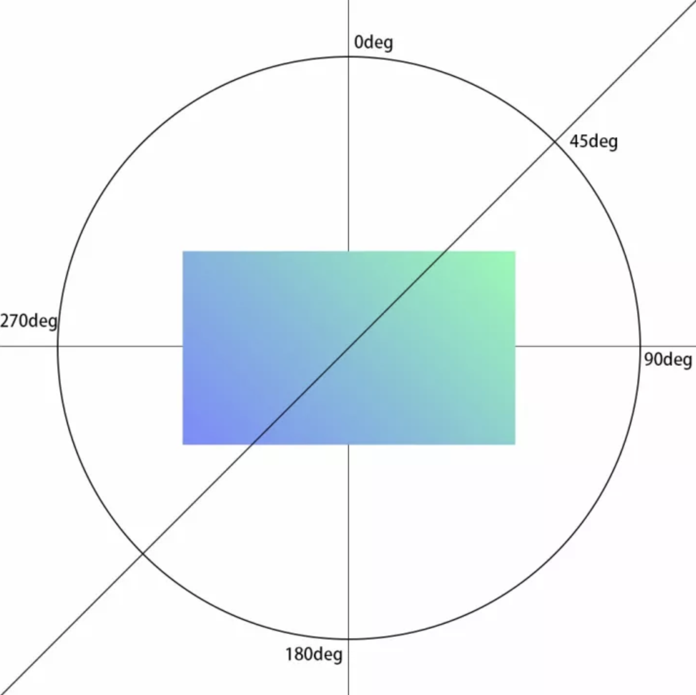
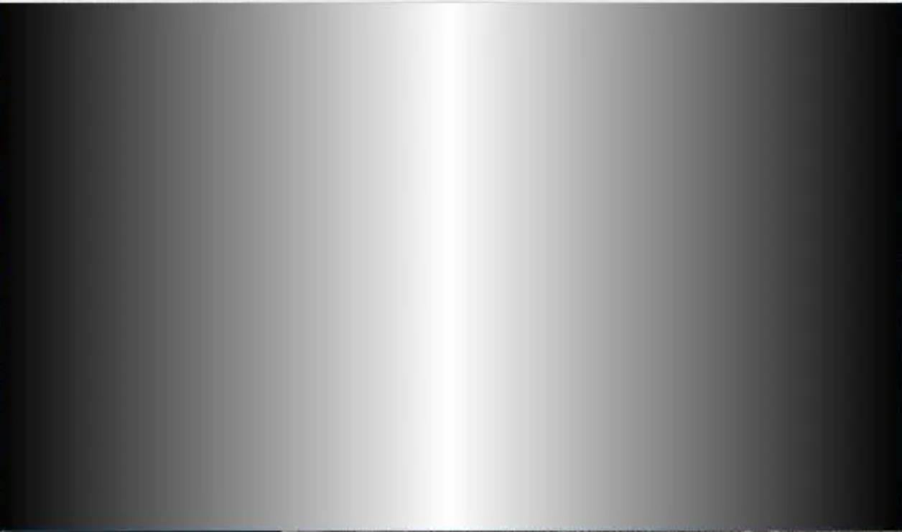
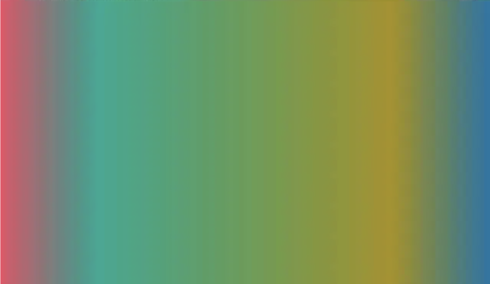
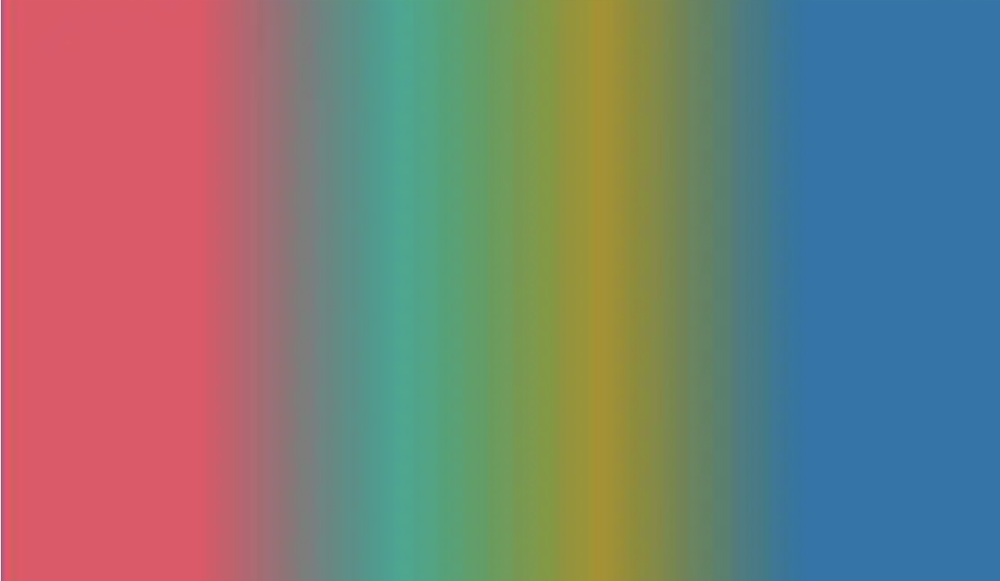

## 线性渐变

background-image: linear-gradient( 角度 , 颜色);

线性渐变是最基本的渐变类型。这种渐变在一条直线上从一个颜色过渡到另一个颜色。



这条直线的方向由角度指定，或者在关键字 to 后面加上 top、bottom、right、left 中的某一个关键字或多个关键字，例如 to bottom left。

如上图例子
 **CSS代码：**


```css
body {
    background-image: linear-gradient(to right , #7A88FF, #7AFFAF);
}
```


如果渐变是从元素上边的紫色过度到下边的绿色，要使用 to bottom 关键字。
 **CSS代码：**


```css
html, body {
    width: 100%;
    height: 100%;
}
body {
    background-image: linear-gradient(to bottom , #7A88FF, #7AFFAF);
}
```


另外，还可以用 to bottom right 这样的关键字指定渐变的角度。使渐变从元素的左上角开始，到元素的右下角结束。
 **CSS代码：**


```css
html, body {
    width: 100%;
    height: 100%;
}
body {
    background-image: linear-gradient(to bottom right, #7A88FF, #7AFFAF);
}
```


过渡所用的颜色可以使用CSS中任何一种颜色值，

渐变方向也不局限于只能使用关键字，还可以使用角度值指定渐变的方向。

角度值的写法：
 在0~360之间的数字后面加上deg，指定过渡在哪个方向结束。

例如， 0deg 表示元素的顶边，所以过渡从底边开始，到顶边结束。

也就是说，
 `background-image: linear-gradient(to top, #7A88FF, #7AFFAF);`
 等价于：
 `background-image:linear-gradient(0deg, #7A88FF, #7AFFAF);`

角度的值按顺时针方向旋转，因此，90deg 表示元素的右边（与 to right 相同），180deg 表示元素的底边（与 to bottom 相同），270deg 表示元素的左边（与 to left 相同）。

使用角度值时，浏览器会绘制一条经过元素中心点的假象线。指定的角度就是这条线的角度，同时还指明过度在哪里结束。




CSS代码：


```css
html, body {
    width: 100%;
    height: 100%;
}
body{
    background-image: linear-gradient(45deg, #7A88FF, #7AFFAF);
}
```

浏览器会绘制一条经过元素中心点的假想线，指向45°刻度，因此，这个过渡从元素的左下角开始，到右上角结束。

这里推荐一个很好玩的网站：
 [https://codepen.io/thebabydino/full/qgoBL](https://links.jianshu.com/go?to=https%3A%2F%2Fcodepen.io%2Fthebabydino%2Ffull%2FqgoBL)


------


## 色标


 **CSS代码：**


```css
html, body {
    width: 100%;
    height: 100%;
}
body{
    background-image: linear-gradient(to right, black, white, black);
}
```



浏览器会平均分布各个颜色。

最后，还可以在颜色后面再加一个值，明确指明各色标的位置。



微信订阅号：Rabbit_svip

**上图的CSS代码：**


```css
html, body {
    width: 100%;
    height: 100%;
}
body {
    background-image: linear-gradient(to right, #E94E65, #15A892 20%, #A89215 80%, #1574A8);
}
```

背景色从左到右开始渐变，最左边是玫红，在元素宽度20%的位置变成青色，80%的位置变成黄色，最后是蓝色。

色标的位置不一定要用百分比，也可以用像素或者em值。不过百分比是最灵活的，会随着元素的宽度或高度而变化。

使用多色渐变时，第一个颜色和最后一个颜色无需指定位置，因为浏览器会嘉定第一个颜色从0%的位置开始，最后一个颜色在100%的位置结束。
 除非想把第一个颜色或最后一个颜色的位置放在指定的位置开始，才需要专门定位。

如：
 **CSS代码：**


```css
html, body {
    width: 100%;
    height: 100%;
}
body {
    background-image: linear-gradient(to right, #E94E65 20%, #15A892 40%, #A89215 60%, #1574A8 80%);
}
```



第一个颜色值（#E94E65）也有位置值（20%）。因此，元素横向前20%宽度的背景色是纯粉红色。从20%的位置开始才由粉红色变成青色。直到40%的位置完全结束粉红色。

此外，因为元素可以有多个背景图，所以也能有多个渐变背景。
 **CSS代码：**


```css
html, body {
    width: 100%;
    height: 100%;
}
body {
    background-image: 
        linear-gradient(to bottom, cyan, transparent),
    linear-gradient(225deg, magenta, transparent),
    linear-gradient(45deg, yellow, transparent);
}
```

使用多个背景图时，最先用到的背景图会在最上层。


