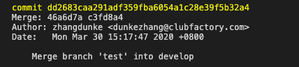

最近写需求合并了一个分支，然后由于某些原因后来不需要合并这个分支了，但是我在合并这个分支后提交了一些commit,当时自己手动去修改了代码～[发现真的好蠢]，后来在同事建议下用了git revert,所以去查了下git revert用法

## git revert

Git 的 revert命令可以用来撤销提交（commit），对于常规的提交来说，相当于做一次被revert的提交的【反操作】并形成一个新的commint.

## 

解释：提交了3个版本的代码，版本2的代码是有问题的，需要回滚掉，但是又希望保存版本1和版本3的代码，这样我们就可以revert版本2，这样就会形成一个commit,就是现在的版本4，版本4是包含了版本1和版本3的代码，并且撤销了版本2的所有操作。

## 基本用法

 * git revert HEAD         撤销前一次 commit
 * git revert HEAD^        撤销前前一次 commit
 * git revert commit （比如：fa042ce57ebbe5bb9c8db709f719cec2c58ee7ff）撤销指定的版本，撤销也会作为一次提交进行保存。

### 但是当你需要撤销一个合并（merge）的时候，事情就变得稍微复杂了一些。

比如我需要撤销一个合并(merge)的时候，事情就变得复杂一些:



我输入

```
git revert dd2683caa291adf359fba6054a1c28e39f5b32a4
```

git就报错

error: commit dd2683caa291adf359fba6054a1c28e39f5b32a4 is a merge but no -m option was given.
fatal: revert failed

这是因为我revert的commit是一个merge commit，它有两个parent,就没法diff，所以就报错了，所以我们要显示告诉Git用哪一个parant

一般来说，我在[develop]分支merge[test]，那么 parent 1就是develop，patent 2 就是test

