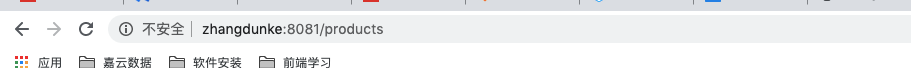

##  hosts文件修改： 
1. 在应用程序里面打开终端(terminal) 
2. 输入 sudo vi /etc/hosts 
3. 接着输入 i 进入编辑模式 
4. 将添加的域名,ip拷贝进去，我随便取了个域名：192.168.1.51     zhangdunke 
5. 编辑完成之后,按esc,输入 ": wq"



## 遇到的问题

配置完后vue项目提示Invalid Host header

在webpack.dev.conf.js的devServer配置中添加disableHostCheck: true

```javascript
  devServer: {
      disableHostCheck: true,
    }
```

 相关原理

这是由于新版的webpack-dev-server出于安全考虑，默认检查hostname，如果hostname 不是配置内的，将中断访问