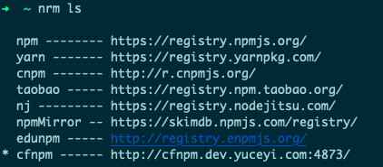

1. npm

   1. npm设置镜像  `npm config set registry http://registry.npmjs.org`
   2. 查看npm当前镜像源 `npm config get registry `

2. npm**源管理器nrm**

   1. 安装: `npm install -g nrm`

   2. 列出可选择的源：` nrm ls`

   3. 切换使用的源：`nrm use npm`

   4. 添加一个源：`nrm add <registry> <url>`

      nrm add cfnpm http://cfnpm.dev.yuceyi.com:4873

      
      
   5. 测试速度`nrm test npm`

3. npm**版本管理器nvm**（管理node）

   1.列出已安装实例`nvm ls`

   2.切换到 4.2.2`nvm use 4.2.2`

   3.全局node修改 `nvm alias default 16`

4. npm钩子

   用户执行`npm run build`的时候，会自动按照下面的顺序执行。

   `npm run prebuild && npm run build && npm run postbuild`

5. Npm 清除缓存

   npm cache verify

6. 删除原有的包文件

   1. rm -rf node_modules
   2. npm cache clean --force   //清除npm缓存