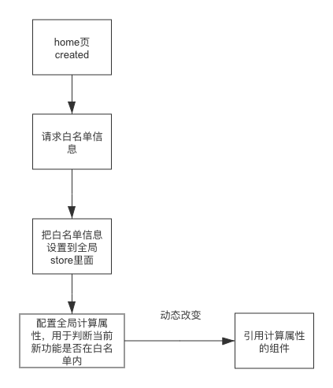

## 1.需求背景

白名单配置是新功能上线时对部分商家开放，等灰测没有问题再全员开发（有少数情况是关闭）

## 2.需求目标

由于这些模块的的白名单配置是分散在各个接口里面，每次增加一个白名单信息会修改接口。现在想统一做处理，返回所有的白名单信息，前端自己通过这些信息进行展示和隐藏。

## 3.方案

JS 代码中做埋点判断，通过对白名单规则的判断来控制组件的显示


## 4.白名单信配置存储，

使用Apollo支持配置，每个新功能上线时以一个对象的形式存储在配置列表中，对象的解释如下：

| 字段            | 解释                                                         |
| :-------------- | :----------------------------------------------------------- |
| name            | 是当前白名单规则的name，用于绑定在前端组件，控制组件显示/隐藏。**新需求上线时，要和前端约定好此字段** |
| `description`   | 内测规则描述，便于配置人员记忆和理解，程序不处理此字段       |
| rule            | `allow - 允许访问``deny - 拒绝访问 `                         |
| `strategy`      | `fixed_sellers - 固定卖家列表，需要联动配置sellerIds``rem - 按照卖家ID取余分桶，需要联动配置remBuckets、remHitBuckent` |
| `sellerIds`     | `卖家ID列表 - 用于固定卖家列表策略`                          |
| `remBuckets`    | 桶数 - 用于取余策略                                          |
| `remHitBuckent` | 余数命中桶编号 - 用于取余策略                                |
| uris            | 后端URI列表，仅用于后端逻辑                                  |
| `denyMessage`   | `拒绝访问的提示信息`                                         |


```javascript
[ {    
  "name": 'name',    
  "description":"白名单描述",   
  "rule": 'allow',    
  "strategy":"fixed_sellers",    
  "sellerIds": [131，132],    
  "uris":["/a/b","/c/d"],     
  "denyMessage":"test for test"  
	}, {    
    "name": 'nametest',    
    "description":"白名单描述",    
    "rule": 'deny',    
    "strategy":"fixed_sellers", //固定卖家    
    "sellerIds": [131，132],    
    "uris":["/a/b","/c/d"],     
    "denyMessage":"test for test"  
  }, { 
    "name": "nametest3",     
    "description":"白名单描述3",    
    "rule": 'allow',    
    "strategy":"rem", //取余算法    
    "remBuckets":10, //取余算法 - 桶数    
    "remHitBuckent":1, //取余算法 - 余数命中桶编号    
    "sellerIds": [],    
    "uris":["/a/b","/c/d"],    
    "denyMessage":"test for test" 
  } ]
```


## 5. 接口

**获取到当前用户可以访问的白名单规则列表：**


```javascript
{ 	
    "data":[ 	
      {"name": 'disputesWight', "rule":'allow'},        
      {"name": 'adCenter', "rule":'deny'} 
    ] 
}
```

前端获取data值进行判断

### 6.前端流程，

获取接口和进入主页异步的，所以有可能获取到接口信息在进入主页之后，所以采用全局计算属性的方式，这样利用vue可以动态去改变页面元素



## 7. 前端配置

#### 把白名单信息设置到全局store里面

```javascript
state:{
  whitelistInfo: {
      whitelist: [],
      hasFetched: false // 是否已经请求接口，用于控制还未请求接口时的白名单相关信息是隐藏的
    }
}
  
```


#### 全局getter是否在白名单内

```javascript
getters:{
  	// 是否在白名单内
    isInWhitelist: (state) => (name) => {
      const { whitelist, hasFetched } = state.whitelistInfo
      if (hasFetched) {
        const foundObj = Array.isArray(whitelist) ? whitelist.find(item => item.name === name) : null
        if (foundObj && foundObj.rule === 'deny') {
          return false
        } else {
          // 如果当前的name不在白名单（apollo配置删掉）这个情况返回true,如果在白名单明确rule为allow也返回true
          return true
        }
      }
      return false
    }
}  

```

### 全局路由配置

```javascript
  import Store from '@/store/index'
  const { state, getters } = Store
  router.beforeEach((to, from, next) => {
  	if (to.meta.hasOwnProperty('mustBeInWhitelist') && state.whitelistInfo.hasFetched) {
    	if (getters.isInWhitelist(to.meta.mustBeInWhitelist)) {
      	next()
       } else {
       		next({ name: 'NotFound' })
        }
    }  
  }

```


### 8.使用

在使用的文件引入getter

```javascript
import { mapGetters } from 'vuex'

computed: {
  ...mapGetters({
    isInWhitelist: 'isInWhitelist'
  })
},
```

####  组件使用

```
button(v-if="isInWhitelist('name')"")
```


####  路由配置

获取到comutedData计算属性，对应的路由加上如下的代码,

```javascript
{ 
  path: 'componentPath',
  name: 'componentName',
  component: component,
  meta: {
  	mustBeInWhitelist:'name'
  }
}
```


