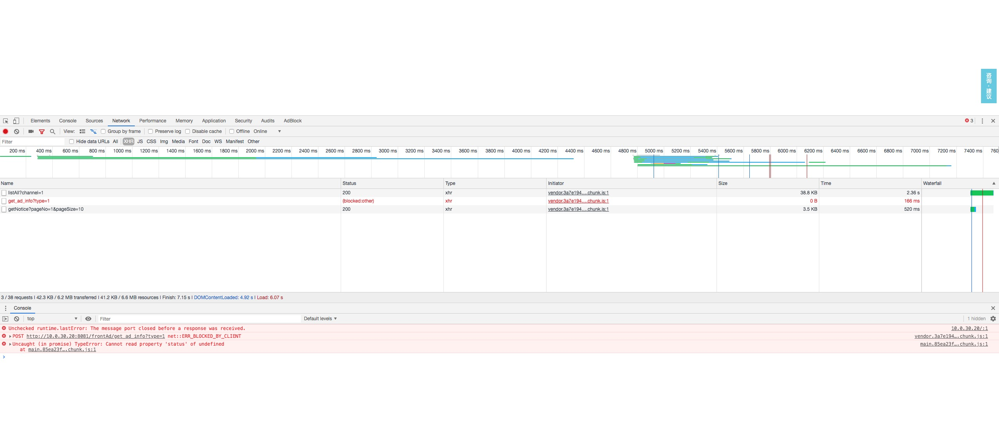

### net::ERR_BLOCKED_BY_CLIENT错误
#### 现象
今天发现有些浏览器加载一些资源的时候，出现**net::ERR_BLOCKED_BY_CLIENT**的错误
### 原因
这是屏蔽广告扩展造成的，比如AdBlock。AdBlock会过滤掉文件名包含**advertise**的资源，js、css等都不能幸免。

在AdBlock的设置里开启控制台输出调试日志会发现资源中招了

### 如何避免
编写过滤规则：[过滤规则](https://adblockplus.org/zh_CN/filters)